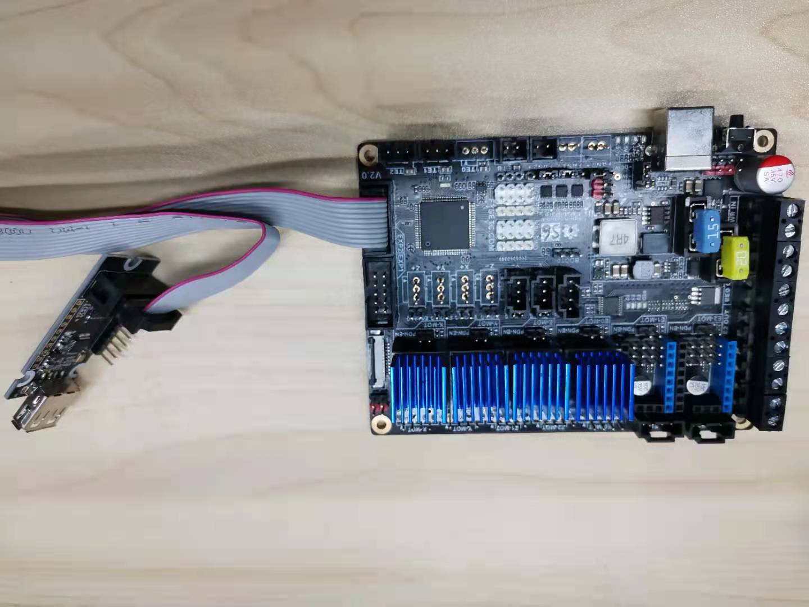

# FYSETC-USB-Host-Adapter

## Hardware

This USB host adapter should work with Marlin standard 3d printer motherboard  that has EXP1 and EXP2 socket. It can be assigned the same pins as the SD card reader, with

   *    SCLK, MOSI, MISO --> SCLK, MOSI, MISO
   *    INT              --> SD_DETECT_PIN [1]
   * SS               --> SDSS

So normally you need to connect it to EXP2.

### F6

### S6

## Marlin

You need to enable the follow defines to make it work.

`#define SDSUPPORT` in `configuration.h` file

`#define USB_FLASH_DRIVE_SUPPORT` in `configuration_adv.h` file

Then you need to compile the Marlin and upload to your mother board.  